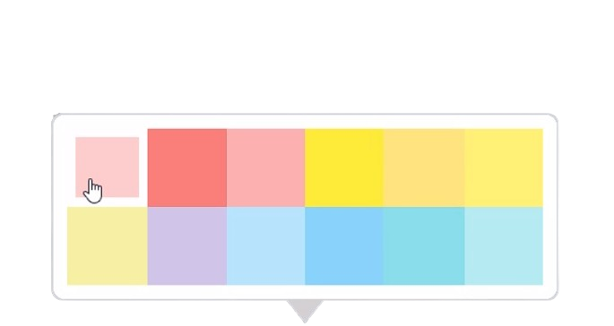

<p align=center>
    
</p>

## <p align=center>Colorkr</p>


<p>

## Usage
```js
import { initColorPicker } from "./colorkr.min.js";

// div id and class 
initColorPicker('your-id')

```


```js
//colorkr.js ln22:col55
arrow.classList.add('arrow-bottom-center'); // adjust arrow any where by changeing given below strings
```
Customize the arrow 
```js
'arrow-top-left',
'arrow-top-center',
'arrow-top-right',
'arrow-left-right',
'arrow-left-center',
'arrow-bottom',
'arrow-bottom-center',
'arrow-bottom-right',
'arrow-right-top',
'arrow-right-center',
'arrow-right-bottom',
```
</p>
